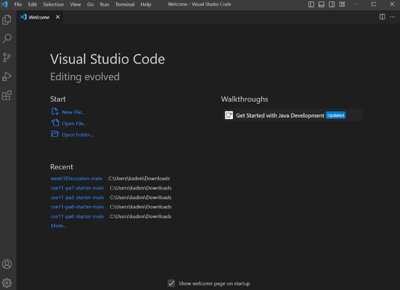
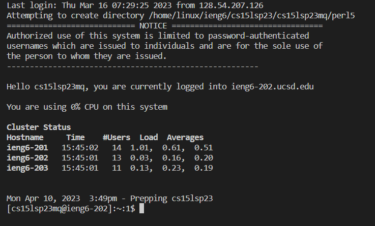
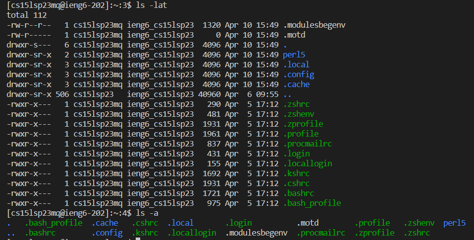

**Hello** *Everyone*

Already had VS code downloaded, but you can install it on the visual code studio website. Download the latest version of it and make sure to download the coding software with it. It this case it is java so you need to install it on the java website. There are a lot of videos on it so looking it up will make it process easier.  

Remotely connecting was a bit of an issue for me intially. The remote server did not allow me in so I had to wait a day for them to fix it on their end. But loging in is really simple. First you must go to the UCSD website to reset the password so that you can login via VS code. If you are windows, like me you then must install git for windows. You then must enable "bash" on the terminal for VS code by changing the default profile. Then you can run the ssh command to login with your CSE15L username and password. Once you login you should get a similar result to the image above. 

I then ran the ls -lat command and the ls -a command. These commands shows the users information when logging into the server. The blue text is the users information and the green text is the server information. 
