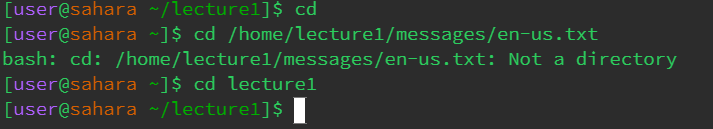
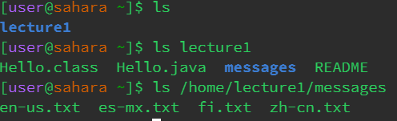
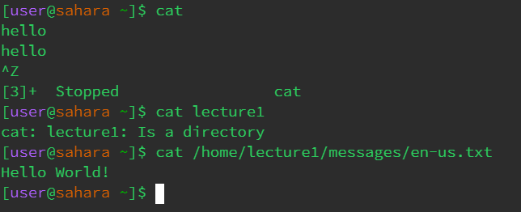

# Cd Command

1) When I first typed cd into the console nothing showed up since it requires a directory to change to. 
The Current working directory was /home since no cd was prompted before this. There was no error since no prompt was given to the command line.

2) When I typed cd lecture1 it changed the current working directory into lecture1.
The working directory was still /home since I just changed the working directory with cd into lecture. There was no error since this is the intended use of the command.

3) When I typed cd with a path to a file there wasn't an error, but there was a message stating that the argument was not a directory since I gave it an absolute path to a file. The current directory was lecture1.

# Ls Command

1) When I typed ls into the console with no argument it showed the file within /home which was lecture1. The working directory at this time was home since there was no cd before this command. There were no errors with this command. 

2) When I typed ls with the path to the directory it showed all the files contained in lecture1. The working directory at this time was also still home since there was no cd command. There were no errors with this command.

3) When I typed ls with a path to a file, it repeated the argument given in the console. The working directory was still home since there were no changes to the directory. There was no error message given.

# Cat Command

1) When I typed in cat with no argument it waited for an argument to concatenate with so the prompt was left empty until I force-stopped the console. The working directory was home since there was no cd command. There was no error with this command since it was just waiting for a follow-up for the cat command.

2) When I typed in cat with a directory it gave the message that lecture1 is a directory. Since concatenate displays the contents files or combines files it wouldn't show the folders or files in lecture1. The current directory was home. There was no error message, just a message that the command didn't work.

3) When I typed in cat with a path to a file it displayed the contents of the file in the console. The working directory was home. There was no error message since this is the intended use of the cat command. 
