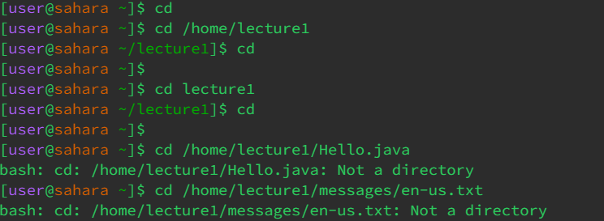
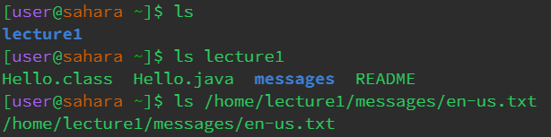

1) When I first typed cd into the console nothing showed up since it requires a directory to change to. 
There was no working directory since I did not use cd to change it. There was no error since no prompt was given to the command line.

2) When I typed cd lecture1 it changed the current working directory into lecture1.
The working directory was the whole file before I typed this command. There was no error since this is the intended use of the command.

3) When I typed cd with a path to a file there wasn't an error, but there was a message stating that the argument was not a directory. The current directory was lecture1.

1)When I typed ls into the command line with no argument, it showed the directory in the file. Since there was no path given it only showed the directory. There was no error for this. 

2) When I typed ls with the path to the directory it showed all the files contained in lecture1. I was not in any directory when I typed the command. 

