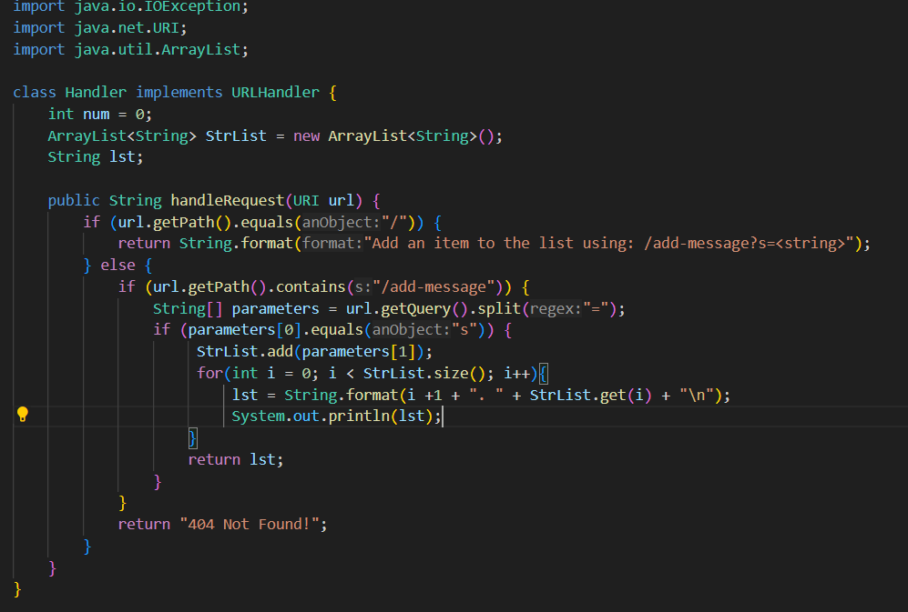

# Part 1
*Note: I know the code is wrong, I just need to figure out how to add each argument to a new line on the server website.*

1) The method initially in the code is getPath() and contains() methods. They check if the path in the URL contains the needed path to add the string to the website. The split() method then splits the query after the equal sign and then uses the right half of the rest of the code. Once the query was split it now reads the string after the question mark and after the equals sign as two different indexes in an array list. I then add the desired word, in this case Hello, into a separate array list and then run through a for loop to print each index in the list on the website.
2) The relevant arguments are the path and the query in the search bar. If neither of them matches exactly what's in the code it will return a 404 error. I declared StrList and lst in the class in order to hold all the strings the user wants to add to the list and print out the list in order respectively.
3) Each of the fields changes in the code since it uses the query in the URL to update specific variables in the code. In this case, it adds the word to a separate array list and then prints out each value on the website. 

1) The method initially in the code is getPath() and contains() methods. They check if the path in the URL contains the needed path to add the string to the website. The split() method then splits the query after the equal sign and then uses the right half of the rest of the code. Once the query was split it now reads the string after the question mark and after the equals sign as two different indexes in an array list. I then add the desired word, in this case Hello, into a separate array list and then run through a for loop to print each index in the list on the website.
2) The relevant arguments are the path and the query in the search bar. If neither of them matches exactly what's in the code it will return a 404 error. I declared StrList and lst in the class in order to hold all the strings the user wants to add to the list and print out the list in order respectively.
3) Each of the fields changes in the code since it uses the query in the URL to update specific variables in the code. In this case, it adds the word to a separate array list and then prints out each value on the website. 
# Part 2
Local ls:

ssh ls:

Login without password:

# Part 3
One thing I didn't know was that we could create a secure path to log in to our course accounts without a password. I never knew that we could create a key on our 
local computer and transfer it via scp to our course account to make a secure path between the two. I'm glad we did that cause I started to find it annoying typing 
in my password every time we needed to use our course accounts. 
