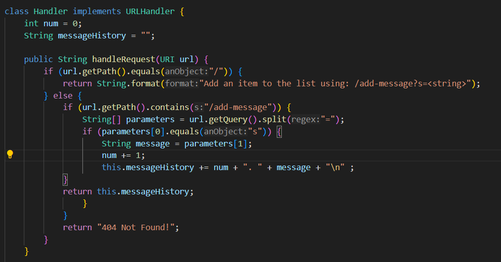
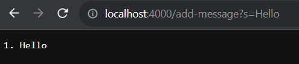
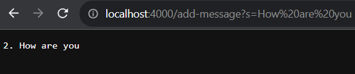

# Part 1

1) The method called when I added hello in the query was handleRequest. The relevant arguments are the query checkers to make sure the paths match the portion of the code so the website can update accordingly. If the path reaches the if statement num and message history is updated to increment num by 1 and add the query message into the message history. 

2) When adding the second message from the website all of the other processes remain the same. What differs is that the value of num changes to be incremented by 1 and message history is updated to contain the new query in the url along with a new line. 
# Part 2
Local ls:

id_rsa is the private key

ssh ls:

id_rsa.pub is the public key

Login without password:

# Part 3
One thing I didn't know was that we could create a secure path to log in to our course accounts without a password. I never knew that we could create a key on our 
local computer and transfer it via scp to our course account to make a secure path between the two. I'm glad we did that cause I started to find it annoying typing 
in my password every time we needed to use our course accounts. 
