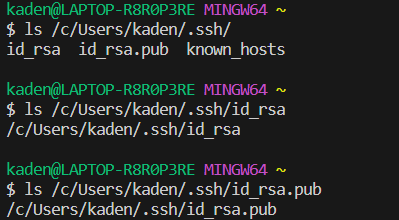
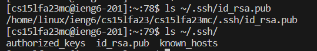
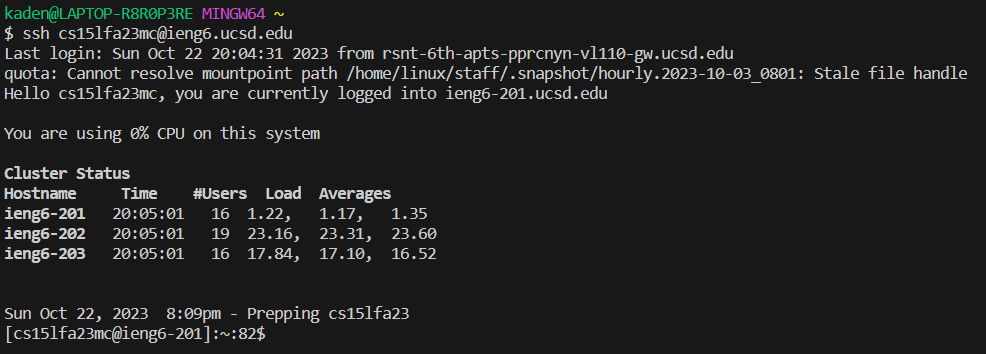

# Part 1

# Part 2
Local ls:

ssh ls:

Login without password:

# Part 3
One thing I didn't know was that we could create a secure path to log in to our course accounts without a password. I never knew that we could create a key on our 
local computer and transfer it via scp to our course account to make a secure path between the two. I'm glad we did that cause I started to find it annoying typing 
in my password every time we needed to use our course accounts. 
