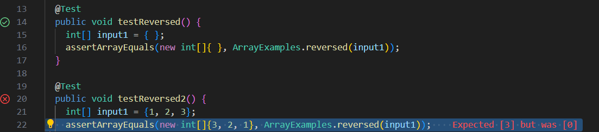

# Part 1
1)
```
@Test
  public void testReversed2() {
    int[] input1 = {1, 2, 3};
    assertArrayEquals(new int[]{3, 2, 1}, ArrayExamples.reversed(input1));
  }
```

2)
```
@Test
  public void testReversed() {
    int[] input1 = { };
    assertArrayEquals(new int[]{ }, ArrayExamples.reversed(input1));
  }
```
3)


4)
Before:
```
static int[] reversed(int[] arr) {
    int[] newArray = new int[arr.length];
    for(int i = 0; i < arr.length; i += 1) {
      arr[i] = newArray[arr.length - i - 1];
    }
    return arr;
  }
```

After: 
```
static int[] reversed(int[] arr) {
    int[] newArray = new int[arr.length];
    for(int i = 0; i < arr.length; i += 1) {
      newArray[i] = arr[arr.length - i - 1];
    }
    return newArray;
  }
```

Intitially the code was replacing the elements of the arr with the elements of newArray. But since newArray was an empty array with the length of arr it would replace all the values of arr with 0, resulting in a 0 array. 
You must rearrange the code so that newArray takes the elements of arr copies it in the reverse order in the brackets and returns the new array.

# Part 2
**Website used: https://en.wikibooks.org/wiki/Grep**

Grep command line options:
1)
```
grep -r
```
Recursively searches files that contain the given string in the command line, notice how -r gives the line it is one in the file

Example 1:
```
$ grep -r "base pair" technical/plos/*.txt
technical/plos/journal.pbio.0020190.txt:        sequence, which is a specific series of eight base pairs in the DNA of the bacterial
technical/plos/journal.pbio.0020190.txt:        chromosomes, on the order of one or two thousand base pairs of DNA (or less—their length is
technical/plos/journal.pbio.0020223.txt:        Watson-Crick base pairing, the proximity of the synthetic reactive groups elevates their
```
This example shows the files that contain "base pair" in the plos directory. It shows the sentence that it is in after it displays the file. 

Example 2:
```
$ grep -r "whale" technical/biomed/*.txt
technical/biomed/1476-069X-2-7.txt:        marine fish, whale meat and blubber, supported a relation
```
This example shows searching for "whale" recursively in all of the files in the biomed directory. It also shows the file and the sentence it is on.
These two examples are useful when you are looking for the file and the sentence each keyword is in.
2)
```
grep -l 
```
gives the file that has the same string in the argument, but does not give the line it is on.

Example 1:
```
$ grep -l "base pair" technical/plos/*.txt
technical/plos/journal.pbio.0020190.txt
technical/plos/journal.pbio.0020223.txt
```
This shows searching "base pair" in the plos directory. It will only show the what file the word is contained it. 

Example 2:
```
$ grep -l "giga" technical/biomed/*.txt
technical/biomed/1471-2202-3-8.txt
technical/biomed/1471-2202-4-3.txt
technical/biomed/gb-2001-2-8-research0027.txt
technical/biomed/gb-2002-3-10-research0052.txt
technical/biomed/gb-2002-4-1-r1.txt
```
This shows searching "giga" in the biomed directory. It also only shows what files the keyword is in. 
These two examples are useful if you only need the location of the file the word is in and not any other information.

3)
```
grep -n 
```
searches for files with the given argument outputs the line it is on, and what sentence it is.

Example 1:
```
$ grep -n "base pair" technical/plos/*.txt
technical/plos/journal.pbio.0020190.txt:22:        sequence, which is a specific series of eight base pairs in the DNA of the bacterial
technical/plos/journal.pbio.0020190.txt:31:        chromosomes, on the order of one or two thousand base pairs of DNA (or less—their length is
technical/plos/journal.pbio.0020223.txt:46:        Watson-Crick base pairing, the proximity of the synthetic reactive groups elevates their
```
This examples shows the files with the word "base pair" in the directory plos. It shows what line its on at the end of the file and what sentence its in.
Example 2:
```
$ grep -n "whale" technical/biomed/*.txt
technical/biomed/1476-069X-2-7.txt:26:        marine fish, whale meat and blubber, supported a relation
```
This shows the keyword "whale" in the biomed directory what line it is on and what sentence it is in. 
Both of these examples have the most potential of usefulness out of the commands since it gives you the most information for the keyword. 
4)
```
grep -b
```
searches for files with the given argument outputs the file, the sentence it was in, and how many words appeared before the word was found

Example 1:
```
$ grep -b "base pair" technical/plos/*.txt
technical/plos/journal.pbio.0020190.txt:1521:        sequence, which is a specific series of eight base pairs in the DNA of the bacterial
technical/plos/journal.pbio.0020190.txt:2408:        chromosomes, on the order of one or two thousand base pairs of DNA (or less—their length is
technical/plos/journal.pbio.0020223.txt:3740:        Watson-Crick base pairing, the proximity of the synthetic reactive groups elevates their
```
This example shows the keyword "base pair" in all the files in the plos directory. It shows how many words appeared before the keyword at the end of the file. It also shows what sentence it is in. 
Example 2:
```
$ grep -b "whale" technical/biomed/*.txt
technical/biomed/1476-069X-2-7.txt:1344:        marine fish, whale meat and blubber, supported a relation
```
This example shows the keyword "whale" in the biomed directory. It shows how many words appear before it along with the sentence it is in.
Counting the words before the keyword does not have any particular use unless you are looking for something really specific. 
