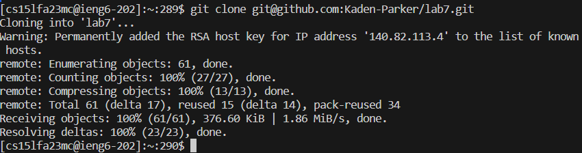
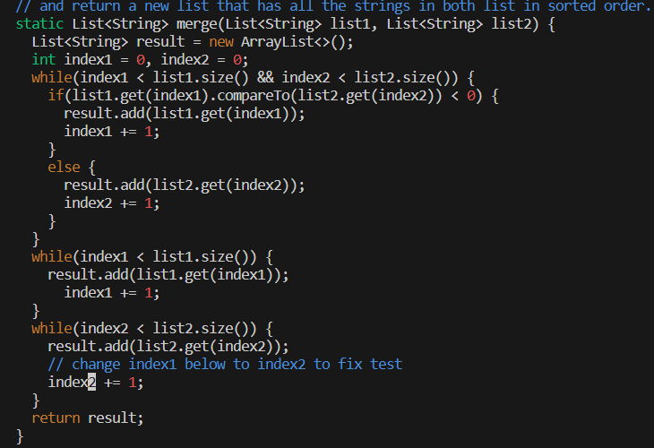

# Ignore all quotations for the command inputs 

I pressed up once in my terminal since it was my history from using it. 

This was also in the history of my ssh account but I had to press up 12 times to access it. 

To change the directory I typed <"c d"> <"space"> <"l"> <"tab"> <"enter"> since I was able to auto complete it. 
Then I typed <"b a s h"> <"space"> <"t"> <"tab"> <"enter"> since I was also able to auto complete it. 

I then typed <"v i m" > <space> <" L i s t"> <E> <"tab"> <". j a v a "> <"enter">. I used tab here to autocomepete the examples in the line then added the .java at the end since there were two ListExamples files. 
Once I was in vim I typed <"43"> <"enter"> to get to line 44 where the error was. I then when <"right"> 5 times and then pressed <x> to delete the "1" in "index1". I then typed <"i"> to get into insert mode. 
I then pressed <"2"> to replace the empty space I had deleted previously.  I then pressed <"esc"> to return to normal mode. I then typed <":wq"> <"enter"> to save and exit the file. 

I then typed <"b a s h"> <"space"> <"t"> <"tab"> <"enter"> just like step 6 in order to test the file. 

For These steps, I just typed out everything in the console line and pressed <enter> once the message was typed out.  
