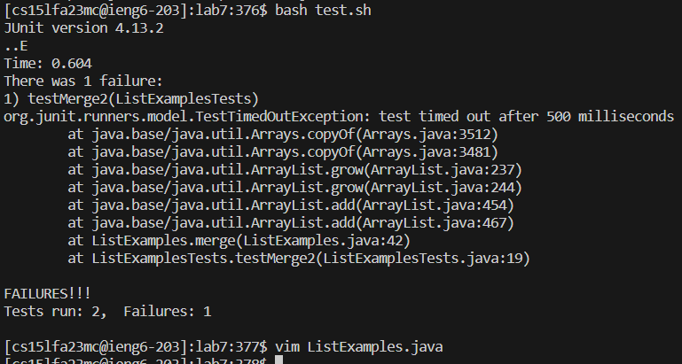
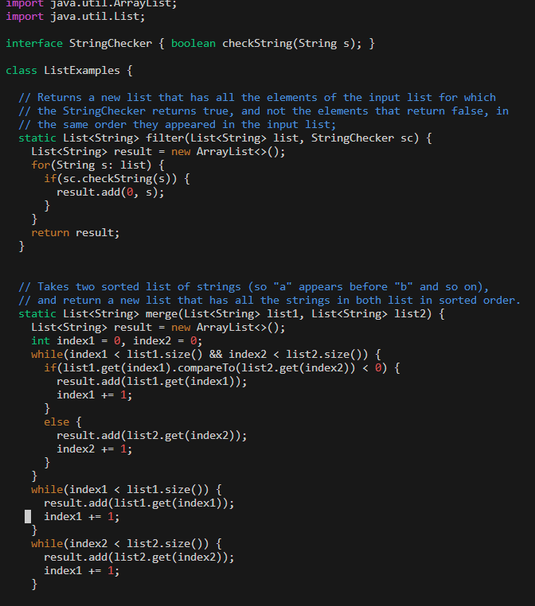
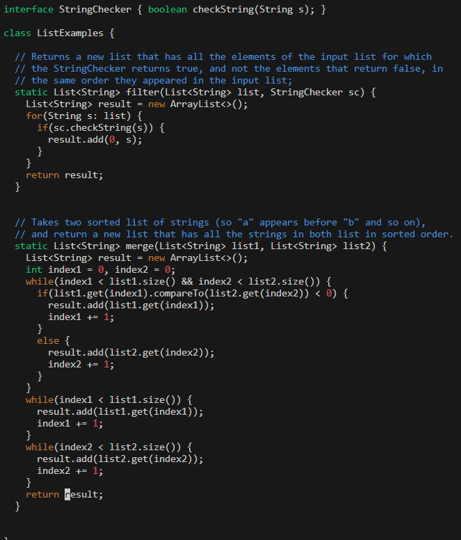

**Anonymous:** Hi, I seem to be having some problems with my code. When I bash the test script I keep getting an error message where my code times out. 
It has to do with the main Java file since the test the other test seems to be working fine. I would appreciate any help. 

**TA:** Hi Anonymous the error message you are getting in your test is a result of an infinite loop in your code. 
So checking any while loops in your code and making sure they don't run infinitely should resolve your issue. 

**Anonymous:** After tinkering around with my code I figured out that the infinite loop was with the 2nd while loop. Since it was adding to index1 instead of index2 it would keep running the while loop 
since index2 would always be less than list2.size. 

The file and directory were given in the screenshots so that saved a lot of time communicating back and forth. The contents of each file were shown in the initial 2 screenshots. The command line that caused the bug was run was a 
bash file that ran the tests for the ListExamples.java file. Fixing the bug was a simple fix to negate an infinite while loop. 

**Reflection:** One thing I did not know was how to use vim in any terminal. I knew what vim was since my friend is in CSE 30 and he uses a lot of vim there. I didn't even know what exactly it was until the 2nd half of this course..
It is cool to learn what vim is since it will be useful throughout my cs career. 
